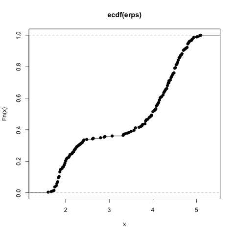
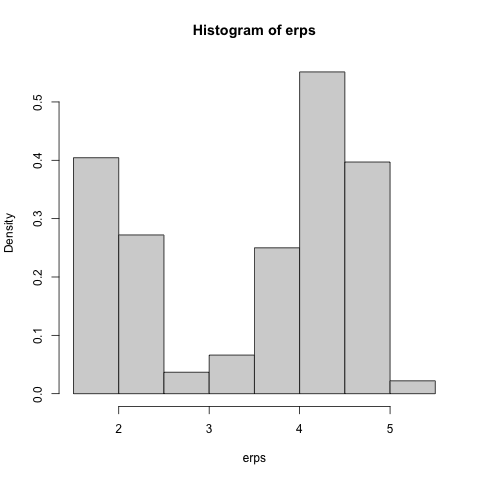
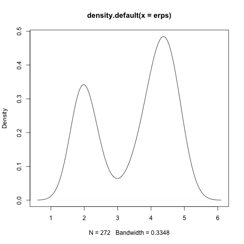
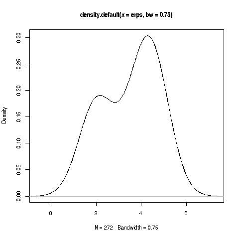
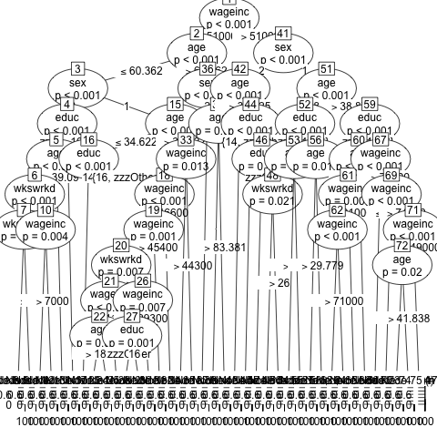
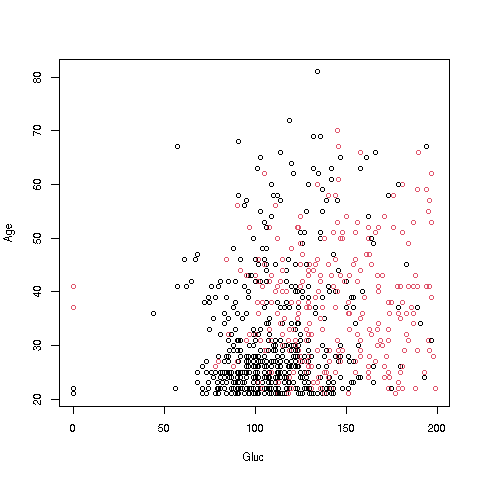
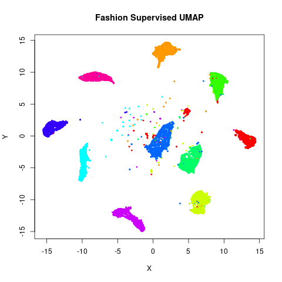

# fastStat: All of REAL Statistics

## *"Quick intro to (REAL) statistics for those who know probability"*

### Norm Matloff, Prof. of Computer Science, UC Davis; [my bio](http://heather.cs.ucdavis.edu/matloff.html)

(See notice at the end of this document regarding copyright.)

# WHO IS THIS FOR?

Students in computer science, engineering, mathematics and the like
typically take a course in calculus-based probability -- unconditional
and conditional probability, cdfs and density functions, expected value
and so on.  (The material is in Chapters 1-9 of 
[my online book](https://github.com/matloff/probstatbook).)
But later they have a need to use statistics, and find it's
a broader and more nuanced field than they had realized.

**This document will enable such people to quickly acquire the needed
concepts, with a good intuitive understanding.**  It is modeled after
my popular [fasteR tutorial](https://github.com/matloff/fasteR) for
quickly becoming proficient in R. 

By the way, the title, "All of REAL Statistics," is a play on the titles
of two excellent books, *All of Statistics* and *All of Nonparametric
Statistics*, by one of my favorite statisticians, Larry Wasserman.  Both
books are quite thin, making their "All of" titles ironic.  Well, my
short tutorial here is even more "all of" in that sense.

# What Is Really Going on in Statistics?

Professional statisticians, especially Statistics professors, may find
the presentation here to be a familiar story, but with an odd plot,
a different cast of characters, and a different ending. :-)  It will be
the standard material, but viewed a broader contexts, especially real
world practice.

Indeed, **many of readers of this tutorial will be surprised to see that
it does not contain many equations.**  But sadly, many people know the
mechanics of statistics very well, without truly understanding on
intuitive levels what those equations are really doing, and this is our
focus.

For instance, consider estimator bias. Students in a math stat course
learn the mathematical definition of bias, after which they learn that
the sample mean is unbiased and that the sample variance can be
adjusted to be unbiased.  But that is the last they hear of the issue.
Actually, most estimators are in fact biased, and lack "fixes" like that
of the sample variance.  Does it matter?  None of that is discussed in
textbooks and courses.

We will indeed do some math derivations here, but not at the outset, and
not highlighted.  This tutorial aims to explain the practical ISSUES. 
Many of these are rather generally known, but not written down in books.
Some are actually not widely known.  And some are entirely new ways of
looking at familiar statistical concepts and properties.

# Table of contents

- [Lesson SAMPLING:  The Notion of a Sample](#lesson-sampling--the-notion-of-a-sample)
- [Lesson NORMALETC:  The Role of Normal (Gaussian) and Other Parametric Distribution Families](#lesson-normaletc--the-role-of-normal-gaussian-and-other-parametric-distribution-families)
- [Lesson CONCEPTPOPS:  Conceptual Populations](#lesson-conceptpops--conceptual-populations)
- [Lesson STDERRS:  Standard Errors](#lesson-stderrs--standard-errors)
- [Lesson BIAS:  Bias, and Impact on Standard Errors](#lesson-bias--bias-and-impact-on-standard-errors)
- [Lesson INDICATORS:  Indicator Variables](#lesson-indicators--indicator-variables)
- [Lesson CI:  Confidence Intervals](#lesson-ci--confidence-intervals)
- [Lesson CIAPPROX:  Confidence Intervals from Asymptotics](#lesson-ciapprox--confidence-intervals-from-asymptotics)
- [Lesson CONVERGE:  More on Asymptotics](#lesson-converge--more-on-asymptotics)
- [Lesson SOMEMATH:  some derivations](#lesson-somemath--some-derivations)
- [Lesson SIG: significance testing](#lesson-sig-significance-testing)
- [Lesson GEYSER:  old faithful geyser example](#lesson-geyser--old-faithful-geyser-example)
- [Lesson MLEMM:  general methods of estimation](#lesson-mlemm--general-methods-of-estimation)
- [Lesson ESTDISTRS:  estimating entire distributions](#lesson-estdistrs--estimating-entire-distributions)
- [Lesson TRADE:  the bias-variance tradeoff](#lesson-trade--the-bias-variance-tradeoff)
- [Lesson MULTI:  multivariate distributions and correlation](#lesson-multi--multivariate-distributions-and-correlation)
- [Lesson CORR:  correlation](#lesson-corr---correlation)
- [Lesson MVN:  the multivariate normal distribution family](#lesson-mvn--the-multivariate-normal-distribution-family)
- [Lesson PREDICT:  predictive modeling -- preliminaries](#lesson-predict--predictive-modeling----preliminaries)
- [Lesson MLB:  the mlb dataset](#lesson-mlb--the-mlb-dataset)
- [Lesson LIN:  predictive modeling -- linear](#lesson-lin--predictive-modeling----linear)
- [Lesson LOGIT:  predictive modeling -- logistic](#lesson-logit--predictive-modeling----logistic)
- [Lesson KNN:  predictive modeling -- k-nearest-neighbors](#lesson-knn--predictive-modeling----k-nearest-neighbors)
- [Lesson TREE:  predictive modeling -- tree-based algorithms](#lesson-tree--predictive-modeling----tree-based-algorithms)
- [Lesson SVM:  predictive modeling -- support vector machines](#lesson-svm--predictive-modeling----support-vector-machines)
- [Lesson NEURAL:  predictive modeling -- neural networks](#lesson-neural--predictive-modeling----neural-networksmachines)
- [Lesson NBHR:  predictive modeling -- a feature neighborhood view of overfitting in ml](#lesson-polyml--predictive-modeling----a-feature-neighborhood-view-of-overfitting-in-ml)
- [Lesson POLYML:  predictive modeling -- a polynomial view of overfitting in ml](#lesson-polyml--predictive-modeling----a-polynomial-view-of-overfitting-in-ml)
- [Lesson OVER:  predictive modeling -- avoiding overfitting](#lesson-over--predictive-modeling----avoiding-overfitting)
- [Lesson NOWORRY:  predictive modeling -- ignoring overfitting](#lesson-noworry--predictive-modeling----ignoring-overfitting)
- [Lesson PRIVACY:  data privacy](#lesson-privacy--data-privacy)

## Lesson SAMPLING:  the Notion of a Sample

We've all heard the term *margin of error* in an opinion poll.  It will
be discussed in detail in a later lesson, but what question is it
addressing?

Say the poll consists of querying 1200 people.  These were drawn
randomly from some list, say a list of phone numbers.  The point is that
if we were to do this again, we would get 1200 other people, and the
percentage saying Yes to our question would change.  Thus we want to
have some idea as to how much our Yes percentage varies from one sample
of 1200 people to another.  

(Note: Sampling 1200 people is not referred to as "1200 samples."  The
set of 1200 people is referred to as one sample of size 1200.) 

Let's set some notation.  Say we are interested in some quantity X, say
human height.  We take a sample of n people from a given target
population, and denote the value of X in the i<sup>th</sup> person in
our sample by X<sub>i</sub>.  If we sample with replacement (or if n is
small relative to the total population size), the X<sub>i</sub> are
independent random variables.  Also, each X<sub>i</sub> has distribution
equal to that of the sampled population.  If, say 22.8% of people in
this population are taller than 70 inches, then P(X<sub>i</sub> > 70) =
0.228.

So, X<sub>1</sub>,...,X<sub>n</sub> are independent, identically
distributed random variables (iid).

## Lesson NORMALETC:  the Role of Normal (Gaussian) and Other Parametric Distribution Families

In the last lesson, we talked about the distribution of X in the
population.  Although the population is finite (more on this below) and
thus X is a discrete random variable, one often models X as continuous,
with its distribution being in the normal family.

Why do this?

* Histograms of X in many applications do look rather bell-shaped.  This
  may in turn be due to the Central Limit Theorem (CLT).  The CLT says
that sums are approximately normal, and in the human height case, one
can think of the body as consisting of chunks whose heights sum to the
height of the person.  (The CLT assumes i.i.d. summands, and the chunks
here would be neither independent nor indentically distributed, but
there are non-i.i.d. versions of the CLT.)

* The early developers of statistics had no computers, and it turns out
  that the normal distribution family is quite mathematically tractable,
thus amenable to closed-form "exact" solutions.

* It is often the case in math that discrete quantities are approximated
  by continuous ones (also vice versa).

* A normal distribution is determined by two parameters, the mean and
  variance of the distribution.  Without that assumption, we have many
  parameters, essentially infinitely many.  Let F<sub>x</sub> be the cdf
  of X, i.e. F<sub>X</sub>(t) = P(X &le; t).  Well, there are infinitely
  many possible values for t, thus infinitely many values of F<sub>X</sub>(t).
  But if we assume X is normal, those infinitely many values are all
  expressible in terms of just two numbers.  We are then essentially
estimating two numbers instead of infinitely many.

Another popular model is the exponential distribution family.  You
probably learned in your probability course that it is "memoryless,"
which makes it a suitable model in some applications.

Note that, as models, these are necessarily inexact.  No distribution in
practice is exactly normal, for instance.  No one is 900 feet tall, and
no one has a negative height.  For that matter, a normal distribution is
continuous, whereas X is discrete, for two reasons:

* We are sampling from a finite population.

* Our measuring instruments have only finite precision.  If, say, X is
  bounded between 0 and 10, and is measured to 2 decimal places, X can
take on 1000 values, and thus is discrete.

But what are we estimating, in light of the fact that our model is only
approximate?  Say for instance we model X as having a gamma
distribution.  Then in some sense, depending on how we estimate, we are
estimating the gamma distribution that is closest to our true population
distribution.

## Lesson CONCEPTPOPS:  Conceptual Populations

In the opinion poll example, it is clear as to which population is
sampled.  In many applications, the issue is more conceptual.  If for
instance we run a clinical trial with 100 diabetic patients, we might
think of them as having been sampled from the population of all
diabetics, even though we did not actually select the patients in our
sample, whether randomly or otherwise.

This issue can become quite a challenge in, say, economic analysis.
If we have 10 years of annual data, i.e. n = 10, what population
is that a "sample" from?

Accordingly, in many applications, the population we model as being
sampled from is largely conceptual rather than a tangible entity.

## Lesson STDERRS:  Standard Errors

Earlier we mentioned the "margin of error" in reporting the results of
opinion polls.  To make that notion concrete, let's first discuss a
related idea, *standard errors*.

We use our data X<sub>1</sub>,...,X<sub>n</sub> to estimate some
quantity of interest, say the proportion q of people in the population
who would answer Yes to our poll if we had a chance to ask them all.
Our estimate, Q, would be the proportion of people in our sample who say
Yes.  (**Extremely important note:**  Make sure to always carefully
distinguish between a population quantity, q in this case, and its
sample estimate, Q here.)

We want to have some measure of how much Q varies from one sample to
another.  Of course, Var(Q) is such a measure.

Say for now that the average of Q, averaged over all possible
samples, is q.  For some samples, Q > q, for others Q <- q, but on
average we get q.  This relates to the issue of *bias*, which we will
turn to later, but for now, say we have this situation, i.e. EQ = q.

**The key point:**  If Var(Q) is small, then Q doesn't vary much from one
sample to another, and if EQ = q, then for "most" samples, Q should be
near q.  That is exactly what we hope for!  We only have one sample, of
course, but if we know that Q is usually near q, we feel
reasonably confident that the q from our particular sample is near q.

Of course, the square root of any variance is called the *standard
deviation*.  In the case of an estimator, q here, we use the term
*standard error*.  In some cases, it will be only the approximate
standard deviation, in a sense to be seen below.

## Lesson BIAS:  Bias, and Impact on Standard Errors

In our last lesson, we assumed that EQ = q.  We say that Q is an 
*unbiased* estimator of q.  In English:  The average value of Q over all
possible samples is q. 

In the above example, in which Q is the sample proportion of Yes's and
q is the correspondng population proportion, it does turn out that Q is
unbiased.  In fact, any sample mean is an unbiased estimator for the
population mean.  (Here X is 1 or 0, so the average of the X<sub>i</sub>
is the proportion of Yes's.)  Let's skip the derivation for now (we'll
have a derivations lesson later), so we can get to the larger issues.

Unbiasedness at first seems to be a very desirable property.  It does
hold for some classical statistical methods, but does not hold for many
others, one of which is the sample variance, as follows.

Say we wish to estimate the population variance &sigma;<sup>2</sup>.
(We are not necessarily assuming a normal distribution.)  In the
population, that is the average squared difference between the data and
their mean.  The sample analog is

S<sup>2</sup> = (1/n) &Sigma;<sub>i</sub><sup>n</sup>
(X<sub>i</sub> - &#x100;)<sup>2</sup>

where &#x100; is the sample mean, (1/n)  &Sigma;<sub>i</sub><sup>n</sup>
X<sub>i</sub>.

Note especially the word *analog* above.  Here is the analogy:

* &sigma;<sup>2</sup> is the average squared distance of X, in the
population, to the population mean.

* S<sup>2</sup> is the average squared distance of X, in the
sample, to the sample mean.

It can be shown that S<sup>2</sup> is biased:

E(s<sup>2</sup>) = [(n-1) / n] &sigma;<sup>2</sup>

The average value of S<sup>2</sup> over all samples is a little too
low.  The amount of bias is 

E(S<sup>2</sup>) -  &sigma;<sup>2</sup> = -1/n  &sigma;<sup>2</sup> 

This bothered the early developers of statistics, who then adjusted the
definition of sample variance to

s<sup>2</sup> = (1/(n-1)) &Sigma;<sub>i</sub><sup>n</sup>
(x<sub>i</sub> - &#x100;)<sup>2</sup>

(In the field of probability and statistics, it is customary to use
capital letters for random variables.  This is an exception.)

The standard error of &#x100; is

s.e.(&#x100;) = S/n<sup>0.5</sup>

(use s instead of s if you wish; it won't matter below).

But most estimators are not only biased, but also lack simple
adjustments like that for S<sup>2</sup> above.  So, one must accept bias in general,
and consider its implications.

In that light, let's return to the discussion of standard error in the
last lesson.  We stated that an estimator with small standard error
would likely be near the population value it is estimating. But note now
that that argument depended on the estimator being unbiased.

But the situation is much more optimistic, actually.  Say an estimator
has bias of size O(1/n), as above.  Typically the size of the standard
error is O(1/n<sup>0.5</sup>).  In other words, the bias is small
relative to the standard error, so the argument in the last lesson still
holds.

## Lesson INDICATORS:  Indicator Variables

Often X has only the values only 1 and 0, indicating the presence or
absence of some trait.  That is the case in the opinion poll, for
example, where the respondent replies Yes (1) or not-Yes (0).  Such a
variable is called an *indicator variable*, as it indicates whether the
trait is present or not.

In this case, &#x100; reduces to the proportion of 1s, as with Q, the
proportion of Yes responses to the opinion poll.  After some algebraic
simplification, it turns out that 

S<sup>2</sup> = &#x100; (1-&#x100;) / n

(or use n-1 instead of n for s).

## Lesson CI:  Confidence Intervals

In our opinion poll example, Q is called a *point estimate* of q.  We
would also like to have an *interval estimate*, which gives a range of
values.  If say in in an election, the results of an opinion poll are
reported as, "Candidate X has support of 62.1% of the voters, with a
margin of error of 3.9%," it is saying,

> a 95% confidence interval (ci) for X's support is (58.2%,66.0%).

A key point is the meaning of "95% confident."  Imagine forming this
interval on each possible sample from the given population.  Then 95% of
the intervals would cover the true value, q.

Of course, we do not collect all possible samples; we just have 1.  We
say we are 95% confident that q is in our particular interval in the
above sense.  

It's exactly like gambling.  We don't know whether our particular roll
of the dice will yield a winner, but if most rolls of the dice do so,
then we may be willing to go ahead.

A note on the phrasing "q is in our interval":  

> Some may take this to mean that q is random, which it is not; q is
> unknown but fixed.  The CI is what varies from one sample to another.
> Some instructors are so worried about such misinterpreation that they
> ban the phrasing "q is in the CI," insisting that students say "The CI
> *contains* q, to emphasize that the CI is random, not q.  To me, that's
> going to absurd lengths to make a point--the two statements are
> linquistically equivalent, after all--but again, these instructors feel
> that misintepretation is less likely this way.  

## Lesson CIAPPROX:  Confidence Intervals from Asymptotics

The early developers of statistics defined a distribution family known
as *Student's t*.  This supposedly can be used to form "exact" CIs, i.e. the
probability of the CI covering the target population value is exactly
0.95, if the population distribution of X is normal.  Student-t is
widely taught, and thus widely used.  **BUT it is just an illusion.**  As
pointed out earlier, no distribution in practice is exactly normal.

What saves the day, though, is the Central Limit Theorem.  &#x100; is a
(scaled) sum, which the CLT tells us is asymptotically normally distributed
as n goes to infinity.

In other words, if we were to compute &#x100; on each of the possible
samples of size n from the population, and then plot the results in a
histogram, the graph would be approximately bell-shaped, and the
probabilities for any range of values would be approximately those of a
normal distribution.  Moreover, the large n, the more bell-shaped it
would be.

Ah, so we're in business:  For any random variable w, the quantity

(W - EW) / (Var(W)<sup>0.5</sup>)

has mean 0 and variance 1.  (This stems simply from the properties of
mean and variance; it has nothing to do with whether W is normal or
not.)  So,

Z = (&#x100; - &mu;) / s.e.(&#x100;)

has mean 0 and variance 1, where &mu; is the population mean of X.
(recall that &#x100; is unbiased for &mu;.)  And since Z actually does
have an approximately normal distribution, its distribution is thus
approximately N(0,1), i.e. normal with mean 0 and variance 1.  

Now since the N(0,1) distribution has 95% of its area between -1.96 and
1.96, we have

0.95 &approx; P[-1.96 < (&#x100; - &mu;) / s.e.(&#x100;) < 1.96]

which after algebra becomes

0.95 &approx; P[
&#x100; - 1.96 s.e.(&#x100;) < &mu; <
&#x100; + 1.96 s.e.(&#x100;))

There's our CI for &mu;!

(&#x100; - 1.96 s.e.(&#x100;), &#x100; + 1.96 s.e.(&#x100;))

We are (approximately) 95% confident that the true population mean is in
that interval.  (Remember. it is the interval that is random, not &mu;.)

And things don't stop there.  Actually, many types of estimators have
some kinds of sums within them, and thus have an approximately normal
distribution, provided the estimator is a smooth function of those sums.

(*Smooth* here means a smooth curve, no sharp corners, thus having a
derivative.  A Taylor series approximation results in a linear function
of normal random variable, thus again normal.)

Thus approximate CIs can be found for lots of different
estimators, notably Maximum Likelihood Estimators and least-squares
parametric regression estimators, as we will see in later lessons.

In other words, we have the following principle (the name is mine, the
principle general):

**The Fundamental Tool of Statistical Inference:**

> If R is a "smooth" estimator of a population quantity r consisting of
> sums, based on an i.i.d. sample, then an approximate 95% confidence
> interval for r is
> 
> (R - 1.96 s.e.(R), R + 1.96 s.e.(R)

Again, the term *smooth* roughly means that R is a differentiable function of
X<sub>1</sub>, ..., X<sub>n</sub>.

By the way, for large n, the Student-t distribution is almost identical
to N(0,1), so "no harm, no foul" -- Student-t will be approximately
correct.  But it won't be exactly correct, in spite of the claim.

## Lesson CONVERGE:  More on Asymptotics

The concept of standard error needs to be clarified.

What does the CLT say, exactly?  The formal statement is

> Say S<sub>n</sub> is the sum of iid random variables, each with mean
> &mu; and variance &sigma;<sup>2</sup>.  Then 
> 
> Z<sub>n</sub> = (S<sub>n</sub> - &mu;) / [&sigma; sqrt(n)] 
> 
> *converges in distribution* to N(0,1), **meaning that** the cdf of
> Z<sub>n</sub> converges to the N(0,1) cdf.

In other words, the asymptotics apply to probabilities--but not to
expected values etc.  Two random variables can have almost the same cdf
but have very different means, variances and so on.  E.g. take any
random variable and shift a small amount of its probability mass from X
= c to some huge number X = d; almost the same cdf, very different mean.

As noted, if a sum is an ingredient in some complicated function
that produces our estimator, we can apply a Taylor series argument to
say that the estimator is asymptotically normal.  But the standard
deviation of that normal distribution may be different from that of the
estimator itself, due to the inaccuracy of the Taylor approximation.

So, the asymptotic statement about regarding R and r above enables us to
compute asymptotically valid CIs based on the N(0,1) cdf.  But the
standard error used in that interval, s.e.(R), is not necessarily the
standard deviation of R. 

## Lesson SOMEMATH:  Some Derivations

As noted earlier, the goal of this tutorial is to develop within the
reader an understanding of the intuition underlying statistical concepts
or methods.  It is not a tutorial on math stat.  Nevertheless, it's
important to show a few derivations.

**&#x100; is an unbiased estimator of &mu;:**

By the linearity of E(), 

E&#x100; = (1/n) &Sigma;<sub>i</sub><sup>n</sup> Ex<sub>i</sub>
= (1/n) n &mu; = &mu; 

**Var(&#x100;) = (1/n) &sigma;<sup>2</sup>, where
&sigma;<sup>2</sup> is the population variance of X**

By the fact that the variance of a sum of independent random variables
is the sum of their variances,

Var(&#x100;) = (1/n<sup>2</sup>) &Sigma;<sub>i</sub><sup>n</sup>
Var(x<sub>i</sub>) = (1/n<sup>2</sup>) n &sigma;<sup>2</sup> = (1/n)
&sigma;<sup>2</sup>

**S<sup>2</sup> is a biased estimator of &sigma;<sup>2</sup></sup>**

For any random variable W (with finite variance), 

Var(W) = E(W<sup>2</sup>) - (EW)<sup>2</sup>  

We will use this fact multiple times.

And the sample analog (just algebraic manipulation) is

S<sup>2</sup> = (1/n) &Sigma;<sub>i</sub><sup>n</sup>
X<sub>i</sub><sup>2</sup> - &#x100;<sup>2</sup>

Applying E() to both sides of this last equation, we have

E(S<sup>2</sup>) =
(1/n) n E(X<sup>2</sup>) -
(Var(&#x100;) + &mu;<sup>2</sup>) =
(&sigma;<sup>2</sup> + &mu;<sup>2</sup>) - [(1/n) &sigma;<sup>2</sup> + &mu;<sup>2</sup>] =
[(n-1)/n] &sigma;<sup>2</sup>

## Lesson SIG: Significance Testing 

The notion of *signficance testing* (ST) (also known as *hypothesis
testing*, and *p-values*) is one of the real oddities in statistics.  

* On the one hand, statisticians are well aware of the fact that ST can
  be highly miseadling.

* But on the other hand, they teach ST with little or
no warning about its dangers.  As a result, its use is widespread--or
more accurately stated, entrenched.

As mentioned, the problems of ST have always been well-known, but
nothing was done about them.  Finally, in 2016, the American Statistical
Association released its first-ever position paper on any topic, stating
what everyone had known for decades: ST is just not a good tool.

To be sure, the ASA stopped short of recommending fully against ST, as
some on the committee were defenders of it to some extent.  The final
statement did vaguely say ST is useful in some settings.  But they gave
no examples of this, and at the very least agreed that ST is indeed
widely misused.  But it is my position that ST should simply not be
used at all.  Instead, analysis should be based on CIs, as explained later in
this lesson.

But first, what is ST?  To keep things simple, let's say we have some
coin, and want to test the null hypothesis H<sub>0</sub>: r = 0.5, where
r is the probability of heads.  We will toss the coin n times, and set R
to the proportion of heads in our sample.

We take an "innocent until proven guilty" approach, clinging to our
belief in H<sub>0</sub> until/unless we see very strong evidence to the
contrary.  Well, what constitutes "strong"?

We look at the ratio W = (R-0.5) / s.e.(R).  R is approximately normal,
as noted earlier, and under H<sub>0</sub> R has mean 0.  So under
H<sub>0</sub>, W ~ N(0,1).  (Tilde is standard notation for "distributed
as.") Then P(|W| > 1.96) &approx; 0.05 and 5% is the traditional standard
for "strong evidence."  We reject H<sub>0</sub> if and only if |W| >
1.96.

And we can get greedy.  What if, say, we find that R = 2.2?  Note:

``` r
> pnorm(-2.2)
[1] 0.01390345
```

Under H<sub>0</sub>, P(|W| > 2.2) &approx; 0.028.  Ah, we would have
rejected H<sub>0</sub> even under the more stringent "strong evidence"
criterion of 0.028.  So we report 0.028, known as the *p-value*.  The
smaller the p-value, the more *signficant* we declare our finding.

Well, what's wrong with that?

* We know *a priori* that H<sub>0</sub> is false.  No coin is exactly
  balanced.  So it's rather silly to ask the question regarding
  H<sub>0</sub>.

* We might be interested in knowing whether the coin is *approximately*
  balanced.  Fine, but the ST is not addressing that question.  Even if
r is just a little different from 0, then as the number of tosses n goes
to infinity, the denominator in W goes to 0, and thus R goes to
&pm;&infin;--and the p-value goes to 0.

* In such a scenario, we declare that the coin is "signficantly" 
unbalanced ("Look, a tiny p-value!"), an egregiously misleading statement.

* We have the opposite problem with small n.  We will declare "No
  signficant difference" when we actually should say, "We have too
little data to make any claims."

One reason that ST is so appealing is that **it allows the user to be
lazy.**  Say we have two drugs, an old one A and a new one B, for treating
high blood pressure.  The user here may be a government agency, deciding
whether to approve the new drug.

Let &mu;<sub>a</sub> and &mu;<sub>b</sub> denote the population mean
effects of the two drugs.  Then the null hypothesis is

H<sub>0</sub>: &mu;<sub>a</sub> = &mu;<sub>b</sub>

Again, we know *a priori* that H<sub>0</sub> must be false--the two
means can't be equal, to infinitely many decimal places--so the test is
meaningless in the first place, and we will have the problems described
above.  But, forget all that--the test gives us an answer, and the user
is happy.

A more careful analysis would be based on forming a CI for the
difference &mu;<sub>a</sub> - &mu;<sub>b</sub>.  That gives us a range
of values, against which we can weigh things like cost differences
between the two drugs, possible side effects and so on.  In addition,
the width of the interval gives the user an idea as to whether there is
enough data for accurate estimation of the means.

Yes, the user does have to make a decision, but it is an informed
decision.  In other words:

> The user is taking responsibility, making an informed decision,
> instead of allowing a poor statistical procedure to make the decision
> for him/her.

Note by the way that what we are NOT doing is
"check to see whether the CI contains 0," which would have all the
problems cited above.

See 
[this document](https://github.com/matloff/regtools/blob/master/inst/nopvals.md)
for further details.  


## Lesson GEYSER:  Old Faithful Geyser Example

To start to make the concepts tangible, let's look at **faithful**, a
built-in dataset in R, recording eruptions of the Old Faithful Geyser in
the US National Park, Yellowstone.

The object consists of an R data frame with 2 columns, **eruptions** and
**waiting**, showing the eruption durations and times between eruptions.
the conceptual "population" here is the set of all Old Faithful
eruptions, past, present and future.

Let's start simple, with a CI for the population mean duration:

``` r
erps <- faithful$eruptions
samplemean <- mean(erps)
s2 <- var(erps)  # this is s^2 not s^2
stderr <- sqrt(s2/length(erps))
c(samplemean - 1.96*stderr, samplemean + 1.96*stderr)
# (3.35,3.62)
```

# Lesson MLEMM:  General Methods of Estimation

So far, we've discussed only ad hoc estimators, set up for a specific
purpose.  It would be nice to have general ways of forming estimators.
The two most common such techniques are *Maximum Likelihood Estimation*
(MLE) and the *Method of Moments* (MM).  Let's illustrate them with a
simple example, MM first.

**The Method of Moments**

> Say we are estimating some parameter &theta; with the estimator (to be
> derived) named T.  Then, in the formal expression for EX, replace
> &theta; by T; set the result to the sample mean &#x100; and solve for T.

Say we are modeling our data X<sub>i</sub> as coming from a population
with an exponential distribution, i.e.

f<sub>X</sub>(t) = &lambda;e<sup>-&lambda;t</sup>, t > 0

It is well known (and easy to derive) that EX = 1 / &lambda;.  Denote
our estimator of &lambda; by L.  Then the above recipe gives us

1 / L = &#x100;

and thus 

L = 1 / &#x100;

It may be that our parametric model has 2 parameters rather than 1, so
now  &theta; = (&theta;<sub>1</sub>,&theta;<sub>2</sub>) and t =
(t<sub>1</sub>,t<sub>2</sub>).  Then in addition to generating an
equation for the sample mean as above, we also generate a second
equation for the sample variance in terms of the &theta;<sub>i</sub>; we
replace the &theta;<sub>i</sub> by t<sub>i</sub>; on the right-hand
side, we write the sample variance.  That gives us 2 equations in 2
unknowns, and we solve for the t<sub>i</sub>.

For instance, say we wish to estimate the parameters &lambda; and c for
a gamma distribution.  One can show that 

EX = c/&lambda; 

and 

Var(X) = c/&lambda;<sup>2</sup>.  

Let C and L denote our estimators of c
and &lambda;, to be derived.  Replacing population quantities by sample
analogs, we set

&#x100; = C/L 

and

S<sup>2</sup> = C/L<sup>2</sup>

Dividing the two equations, that gives us

L = &#x100; / S<sup>2</sup>

and

C = L &#x100;

There are variations.  E.g. instead of the variance and sample variance, we
can use the *second moment*, E(X<sup>k</sup>) and its sample analog

(1/n) &Sigma;<sub>i</sub><sup>n</sup>X<sub>i</sub><sup>k</sup>

This may be easier if, say, we have 3 parameters to estimate.

**The method of maximum likelihood**

Discrete case:

> Say we model the population as having a probability mass function
> p<sub>X</sub> that depends on some (scalar or vector) parameter &theta;.
> Calculate the probability (i.e. "likelihood") of our observed data, as a
> function of &theta;.  Replace &theta; by T everywhere in that
> expression; and finally, then take the MLE to be whatever value of T
> maximizes that likelihood.

If our X<sub>i</sub> are independent, then the likelihood expression is

&Pi;<sub>i</sub><sup>n</sup> p(x<sub>i</sub>)

We take the logarithm, to make derivatives easier.  

Continuous case:

A density function is not a probability -- it can be larger than 1 --
but it does work roughly as a likelihood; if say f(12.3) is large, then
one will see many X that are near 12.3.  So, in the above prescription,
replace p by f.

*asymptotic normality:*  

We mentioned earlier that the CLT not only applies to sums but
also extends to smooth (i.e. differentiable) functions of sums.
That fact is important here.  How does that play out with MMs and MLEs?

MMs: By definition, we are working with sums! 

MLE: The log-likelihood is a sum!

Again, we must be working with smooth functions.  Consider the *negative
binomial* distribution family,

P(X = j) = c(n-1,i-1) r<sup>i</sup> (1-r)<sup>n-i</sup>

This arises, say, from tossing a coin until we accumulate k heads, with
r being the probability of heads.

If our parameter to be estimated is r, with known k, the above is a
differentiable function of r.  But if we don't know k, say we have the
data but did not collect it ourselves, then we don't have
differentiability in that parameter.  Then we cannnot maximize the
likelihood via derivatives, and cannot linearize the resulting equations.
Since the asymptotic normality depends on the latter, we cannot form the
CIs as described earlier.

*R **mle()** function:*

This function will calculate MLEs and give standard errors, in smooth
cases.

``` r
> library(stats4)
> n <- 100
> x <- rexp(n,2)
> ll  # user supplies the log likelihood function
function(lamb) {
   loglik <- n*log(lamb) - lamb*sum(x)
   -loglik
}
<bytecode: 0x105ae8368>
> z <- mle(minuslogl=ll,start=list(lamb=1))
> summary(z)
maximum likelihood estimation

call:
mle(minuslogl = ll, start = list(lamb = 1))

coefficients:
     estimate std. error
lamb    2.195     0.2195

-2 log l: 42.76 

```

*Extent of usage:*

MLEs have appealing theoretical properties.  In smooth settings, they
are optimal, i.e. minimal standard error.  They are quite widely used.

MMs are less popular.  But they are easier to explain, and by the way,
the inventor of the generalized method of moments won the Nobel Prize in
Econoomics in 2013 that developing that method.

## Lesson ESTDISTRS:  Estimating Entire Distributions

Recall the *cumulative distribution function*` (cdf) of a random variable 

f<sub>X</sub>(t) = P(X &le; t)

This is indeed a function; for different values of t, we get different
values of the cdf.

And as always, there are population and sample estimates.  If X is human
height, then F<sub>X</sub>(66.5) is the population proportion of people
with height at most 66.5 inches; the sample estimate of that quantity is
the corresponding sample proportion.

Let's plot the ecdf for the geyser data.

``` r
plot(ecdf(erps))
```



The sample estimate is called the *empirical cdf* (hence the name of the
function).  Note:  Since it consists of proportions (one for each t), it
is unbiased.

What about estimating the probability density function (pdf)?  As noted,
pdfs do not really exist in practice, so "the" pdf here is the one that
best approximates the true population distribution, but from here on,
let's just speak of estimating "the" pdf.

Actually, the familiar histogram is a pdf estimator, provided we specify
that the total area under it is 1.0.  Here it is for the geyser data:

``` r
hist(erps,freq=false)
```



This is interesting, as it is bimodal.  There have been many geophysical
theories on this, e.g. postulating that there are 2 kinds of eruptions.

Histograms are considered rather crude estimators of a density, as they
are so choppy.  A more advanced approach is that of *kernel* density
estimators.  

In estimating the density at a given point t, kernel estimators work by
placing more weight on the data points that are closer to t, with the
weights being smooth functions of the distance to t.  A smooth curve
results.

But what does "close" mean?  Just as histograms have a *tuning
parameter* (called a *hyperparameter* in machine learning circles) in
the form of the bin width, kernel estimators have something called the
*bandwidth*.  Let's not go into the formula here, but the point is that
smaller bandwidths yield a more peaked graph, while larger values
produce flatter curves.

Here are the graphs for bandwidths of 0.25 and 0.75:

``` r
plot(density(erps,bw=0.25))
plot(density(erps,bw=0.75))

```





The first graph seems to clearly show 2 bells, but the second one is
rather ambiguous.  With even larger values for the bandwidth (try it
yourself), we see a single bell, no hint of 2.

How should we choose the bandwidth, or for that matter, the bin width?
if we make the bandwidth too large, some important "bumps" may not be
visible.  On the other hand, if we make it too small, this will just
expose sampling variability, thus displaying "false" bumps.

We'll address this (but unfortunately not answer it) next.

# Lesson TRADE:  the Bias-Variance Tradeoff

In the above histogram of the **erps** data, the graph seems,
for example, to be increasing from 2.5 o 4.5.  Consider in particular
the bin from 3.5 to 4.

The increasing nature of the histogram in that region suggests that the
true population density curve f(t) is also rising from 2.5 to 4.5, and
in particular, from 3.5 to 4.  Yet the histogram height is a constant
from 3.5 to 4.  This likely would mean that the true f(t) curve is
higher than the histogram for t near 4, and lower than the histogram for
t near 3.5.  In other words:

> The histogram, as an estimate of f, is likely biased upward (i.e. 
> bias > 0) near 3.5 and downward (< 0) near 4.

And what if the bin width were much narrower? Then the bias described
above would still exist, but would be smaller.  On the other hand, the
narrower the bin, the fewer the number of data points in each bin, so
the greater the standard error of the histogram height within a bin.
(Roughly speaking, the "n" for the standard error is the number 
of points in the bin.)

In other words:

> There is a tradeoff here: smaller bins produce smaller bias but larger
> variance (and the opposite for larger bins).

So, even though bias was seen not to be an issue in the context of CIs,
it *is* an issue here.

There is no good, universally agreed-to way to choose the bin size.
Various math stat people have done some theoretical work that has led to
suggestions, which you can try, such as setting **breaks='fd'** in your
call to **hist()**.

Where the Bias-Variance Tradeoff really becomes an isssue is in
prediction/machine learning contexts, to be covered later.

# Lesson MULTI:  Multivariate Distributions 

Say we have continuous random variables X and Y.  We of course can talk
about their density functions f<sub>X</sub> and f<sub>Y</sub>, but it's
also important to talk about how they vary (or not) *together*.  First,
the basics:

* f<sub>X,Y</sub>(u,v) = &part;/&part;u &part;/&part;v F<sub>X,Y</sub>(u,v) =
P(x &le;u and y &le;v)

* P((x,y) in A) = &int; &int;<sub>A</sub> f<sub>X,Y</sub>(u,v) du dv

* f<sub>Y | X = v</sub>(u) = f<sub>X,Y</sub>(u,v) / f<sub>X</sub>(u)

# Lesson CORR:  Correlation

One common measure of the relation between variables U and V is their
(Pearson) *correlation*, E(U - EU)`(V - EV)] / sqrt[Var(U Var(V)].  They
need not be normal.  This is a quantity in [-1,1], often denoted by
&rho;.  

One useful interpretation of correlation is that &rho;<sup>2</sup>(U,V)
is the proportional reduction in Mean Squared Error in predicting V.
Here we are comparing predicting V with and without using U.

If we are analyzing a group of variables X<sub>i</sub>, i = 1,...,p,
their *correlation matrix* is p X p, with the i,j element being 
&rho;(X<sub>i</sub>,X<sub>j</sub>).

The *covariance* between variables U and V is the same as the
correlation, but not standardized by the standard deviations:

Cov(U,V) = E(U - EU)`(V - EV)] = E(UV) - EU EV

The *covariance matrix* is defined accordingly.

Note that covariance is bilinear and unaffected by additive constants.
E.g.

Cov(aU+b,cV+d) = ac Cov(U,V)

Note that if U and V are independent, then E(UV) = EU EV, so the
covariance and correlation are 0.  The converse is not true; 0
covariance and correlation do *not* imply independence.

# Lesson MVN: The Multivariate Normal Distribution Family 

Unlike the univariate case, there are very few widely-used parametric
families of multivariate distributions.  The main one is multivariate
normal. 

The MV normal family does have some interesting properties, though:

    - all marginal distributions are MV normal

    - AX is MV normal for MV normal X and constant matrix A

    - conditional distributions, given a singleton value, are MV normal

    - those conditional distributions have mean that is linear in the
      conditioning value, and variance (or covariance matrix) that does
      not depend on that value

# Lesson PREDICT:  Predictive Modeling -- Preliminaries

From the 19th century linear models to today's fancy machine learning 
(ML) algorithms, a major application of statistics has been prediction.  In
this lesson, we set the stage for discussing prediction.

Say we are predicting a scalar Y from (a typically vector-valued) X.  Let
p(X) denote our prediction.  Classically, we wish to minimize the mean
squared prediction error,

E[(Y - p(X))<sup>2</sup>]

Note that E() will be the average over all possible (X,Y) pairs in the
population.  Other loss functions besides squared-error are possible,
but this one is mathematically tractable.

The minimizer is easily shown to be 

p(X) = E(Y | X)

Note that in the case of Y being an indicator variable, this reduces
to 

p(X) = P(Y = 1 | X)

Borrowing from the fact that a typical symbol for the mean is &mu;,
let's define the function

&mu;(t) = E(Y | X = t)

which, as noted, in the case of dichotomous Y becomes

&mu;(t) = P(y = 1 | X = t)

This is called the *regression function of Y on X*.  Note that this is a
general term, not restricted just to the linear model.

Our goal, then, is to use our sample data

(X<sub>1</sub>,Y<sub>1</sub>),...  (X<sub>n</sub>,Y<sub>n</sub>)

to estimate &mu;(t).  Denote the sample estimate by m(t).  To predict a
new case, X<sub>new</sub>, we use m(X<sub>new</sub>).  Keep in mind,
m(t) is an estimate of an entire function here, one value for each t.

We will often take as a convenient example predicting weight Y from
height X, or a vector X = (height,age).

The Bias-Variance Tradeoff becomes key in such models.  The more
predictors we use (*features* in ML parlance), the smaller the bias in
m(t) but the larger the variance.  If we keep adding features, at some
point the variance becomes dominant, and we overfit.

# Lesson MLB:  the MLB Dataset

This data, on major league baseball players in the US, is included with
my [**qeML** package](github.com/matloff/qeML) ("quick ML").

``` r
> head(mlb)
        position height weight   age
1        catcher     74    180 22.99
2        catcher     74    215 34.69
3        catcher     72    210 30.78
4  first_baseman     72    210 35.43
5  first_baseman     73    188 35.71
```

We'll usually use just height, weight and age.

# Lesson LIN:  Predictive Modeling -- Linear

As noted, if (X,Y) has a multivariate normal distribution (say with Y
scalar and X vector), then the following attributes hold:

* linearity of the regresion function:  &mu;(t) is linear in t

* conditional normality of Y given X = t 

* conditional homogeneous variance:  Var(Y | X = t) is constant in t

These traits led to the classical *linear regression
model*:  One assumes that

&mu;(t) = 
&beta;<sub>0</sub> +
&beta;<sub>1</sub> +
...
&beta;<sub>p</sub> 

for a p-predictor model, where t = (t<sub></sub>,...,t<sub>p</sub>)', a
column vector; ' means matrix transpose and the default for vectors is
column form.

in vector form, our assumption is

&mu;(t) = &beta;'(1,t)

where &beta; and (1,t) are taken to be column vectors.

Again, the &beta;<sub>i</sub> are population values.

One also assumes homogeneous variance as above, and of course
independent observations (X<sub>i</sub>,,Y<sub>i</sub>).

The sample estimates vector b is computed by minimizing

&Sigma;<sub>1</sub><sup>n</sup>
[y<sub>i</sub> - b'(1,x<sub>i</sub>)]<sup>2</sup>

A closed-form solution exists, and is implemented in r as **lm()**.

``` r
> z <- lm(weight ~ height+age,data=mlb)
> summary(z)

call:
lm(formula = weight ~ height + age, data = mlb)

residuals:
    min      1q  median      3q     max 
-50.535 -12.297  -0.297  10.824  74.300 

coefficients:
             estimate std. error t value pr(>|t|)    
(intercept) -187.6382    17.9447  -10.46  < 2e-16 ***
height         4.9236     0.2344   21.00  < 2e-16 ***
age            0.9115     0.1257    7.25 8.25e-13 ***
---
signif. codes:  0 ‘***’ 0.001 ‘**’ 0.01 ‘*’ 0.05 ‘.’ 0.1 ‘ ’ 1
...
```

Note the standard errors.  An approximate 95% confidence interval for 
&beta;<sub>age</sub> is

``` r
> rad <- 1.96*0.1257
> c(0.9115 - rad, 0.9115 + rad)
[1] 0.665128 1.157872

```

Ah, even these professional athletes tend to gain weight as they age,
something like a pound per year.

**But what about those above classical assumptions for the linear model?**  Do they matter?

On the one hand, the answer is "not much."  

* The formula for the least-squares estimator b consists of various
  sums, so that the Central Limit Theorem tells us that b is
approximaely normal even if the conditional normality assumption doesn't
hold.

* Violations of the homogeneous conditional variance assumption can be
  handled by *sandwich estimators*, e.g.

``` r
> library(sandwich)
> vcovhc(z)
            (intercept)       height          age
(intercept) 323.5135765 -4.151528253 -0.629074510
height       -4.1515283  0.055692865  0.002166495
age          -0.6290745  0.002166495  0.015967653

```

A more accurate standard error for &beta;<sub>age</sub> is thus

``` r
> sqrt(0.015967653)
[1] 0.1263632
```

(not much change here, but there is a larger difference in some cases).

Those considerations are important if our goal is
*understanding*, e.g. understanding weight gain in pro ball players.

On the other hand, for the *prediction* goal, those issues are
irrelevant; all that really matters is whether the true &mu;(t) is
approximately linear.  (And if it isn't, we aren't achieving the
understanding goal either; our CIs will be invalid.)  That would seem to
argue in favor of using ML models, which do not make linearity
assumptions.

But there's more:

One can fit more complex models that are still linear, e.g.
a full quadratic model of the regression of weight on height and age,

mean wt =  &beta;<sub>0</sub> +  &beta;<sub>1</sub> ht + &beta;<sub>2</sub> age + &beta;<sub>3</sub> ht<sup>2</sup> + &beta;<sub>4</sub> age<sup>2</sup> + &beta;<sub>5</sub> ht age

This is still a linear model, as it is linear in &beta;, even though it
is nonlinear in height and age.

We can fit polynomial models using the 
[polyreg](https://cran.rstudio.com/web/packages/polyreg/index.html)
package (or use **qeml::qepoly()**).  But as we fit polynomials of
higher and higher degree, we quickly run into the Bias-Variance
Tradeoff.  The variance becomes large, i.e. the fitted coefficients will
vary a lot from one sample to another, while the reduction in bias slows
down.  So we risk overfitting.

In that case, a nonparametric model, such as from ML, may work much
better.  However, keep in mind that ML models can overfit too.  More on
this shortly.

# Lesson LOGIT:  Predictive Modeling -- Logistic

What about the case in which Y is an indicator variable, say diabetic (Y
= 1) vs. nondiabetic (Y = 0)?  

Recall that in this setting, &mu;(t) reduces to P(Y = 1 | X = t).  That
makes a linear model untenable, as it would produce values outside the
[0,1] range for probabilities.

Just as the linear model was originally inspired by multivariate
distributions, the same is true for logit.  So again let's start
with the classical normal-distribution based model.  This is known as
*Fisher Linear Discriminant Analysis* (LDA).

Here, the distribution of X, given that Y = i, is assumed multivariate 
normal with mean vector &nu;<sub>i</sub> and covariance matrix c that
does not depend on i.  Let r denote P(Y = 1) (unconditional).

If one then applies Bayes' rule (just a probability calculation,
not Bayesian statistics), one finds that 

P(Y = 1 | X = t)

has a *logistic* (often nicknamed *logit*) form:  If X we have a single
predictor (so &nu;<sub>i</sub> is a scalar and c is just the standard
deviation &sigma;), the form is

P(Y = 1 
| X = t) = 1 / [1 + exp(-{&omega;<sub>0</sub> + &omega;<sub>1</sub>t)}]

for parameters &omega;<sub>0</sub> and &omega;<sub>1</sub>
that depend on the v<sub>i</sub> and &sigma;.
In the case of multiple features, this is

P(Y = 1 | X = t) = 1 / [1 + exp(-&omega;'t)]

**This probability interpretation of logit is key.**

Let's call the above, "the logistic equation."

So again:  Just as the linear model originally arose in the context of
multivariate normal distributions, this was the case for logit as well.
But again, as in the case of the linear model discussion above, we must
ask, **what if the assumptions, e.g. normality, don't hold?**

And the answer is that the logit model is
quite popular anyway, and for good reason:  The logistic equation does
produce a value in (0,1), which is what we want for a probability of
course, yet we still have a linear ingredient &omega;'t, the next-best
thing to a pure linear model.

Moreover, as in the linear case, we can introduce polynomial terms to
reduce model bias.  (It will turn out below that there is also a "polynomial
connection" to some popular ML methods, SVM and neural networks.)

By the way, many books present the logit model in terms of "linear
log-odds ratio."  The odds ratio is 

P(Y = 1 | X = t) / [P(Y = 0 | X = t)]

While it is true that the log of that quantity is linear in the logit
model, this description seems indirect.  We might be interested in the
odds, but why would the *logarithm* of the odds be of interest?  It's
best to stick to the basics:

* A model for a probability should produce values in (0,1).

* It would be nice if the model has an ingredient the familiar linear
  form.

Logit, which we have handy from LDA, satisfies those desiderata.

# Lesson KNN:  Predictive Modeling -- k-Nearest Neighbors 

One of the simplest ML methods is k-Nearest Neighbors.  Say we are
predicting weight from height and age, and must do so for a new case in
which X = (70,28).  Then we find the k rows in our training data that
are closest to (70,28), find the average weight among those data points,
and use that average as our predicted value for the new case.

# Lesson TREE:  Predictive Modeling -- Tree-Based Algorithms 

This ML category is almost as simple to explain.  At the root of the
tree, we ask whether a given feature is above or below a given
threshold, and then go left or right accordingly.  At our next node, we
ask the same question of another feature, and so on.  

Eventually we wind up in a leave.  In the continuous Y case, our
prediction is the average Y value in the leaf; for categorical Y, our
prediction is whichever category is most numerous in the leave.

Here is a picture from using **qeML::qeDT()** on the Census data in
**qeML**:

Here we are predicting one of 5 occupations.  The picture is too small
for this dataset, with all the leaves jumbled together at the bottom,
but the process should be clear.



# Lesson SVM:  Predictive Modeling -- Support Vector Machines 

SVM is used mainly in classification contexts. Here we will assume just
two classes, for simplicity.                                                 

The idea behind SVM is very simple. think of the case of two features.
We can plot the situation as follows.  Consider this graph, in the
context of predicting diabetes, from blood glucose and age:



The red dots are the diabetics.  We would like to draw a line so that
most of the red dots are on one side of the line and most of the black
ones are on the other side.  We then use that line too predict future
cases.  Of course if we have more than two features the line becomes a
plane or hyperplane.                    

Well, why just limit ourselves to a straight line? Why not make it a
quadratic curve, a cubic curve and so on?  Each one gives us more
flexibility than the last, hence a potentially better fit.

That is exactly what SVM methods do, apply a transformation (a *kernel*)
to the features, and then find a straight line separating the
transformed data. This is equivalent to forming a curvy line in the
original X space.  There are many common choices of kernels, including
polynomials.

# Lesson NEURAL:  Predictive Modeling -- Neural Networks

In a neural network (NN), , we have a set of layers. Think of them as
being arranged from left to right. The input data goes in on the left
side and the predicted values come out on the right side. the output of
each layer gets fed in as input to the next layer, being fed through
some transformation (an *activation function*). At each layer, in
essence the input is sent through a linear regression estimation, with
the result then passed on to the next layer.  

A layer consists of a number of *units*.  Every output of one layer is
fed into each unit of the next layer.  So the number of units per layer,
and the number of layers, are hyperparameters.

# Lesson NBHR:  Predictive Modeling -- a Feature Neighborhood View of Overfitting in ML

The Bias-Variance Tradeoff with k-NN is clear (and similar to the density
estimation example above).  If k is large, the neighborhood of (70,28)
will be large, and thus will contain some unrepresentative points that
are far from (70,28).  If k is small, the sample mean in our
neighborhood will have a large standard error, as its "n" (k here) is
small.

The situation is similar for tree-based methods (CART, random forests,
gradient boosting).  As we move down a tree, we add more and more
features to our collection, and the nodes have less and less data.  For
a fixed amount of data, the more levels in the tree, the fewer data
points in each of the leaves.  Since the leaves are similar to
neighborhoods in k-NN, we see the same Bias-Variance Tradeoff.

# Lesson POLYML:  Predictive Modeling -- a Polynomial View of Overfitting in ML

In Lesson LIN, We discussed overfitting in the context of
polynomial regression.  Here polynomials will give us a look into how ML
algorithms can also overfit, specifically in support vector machines 
(SVM) and neural networks (NNs).

Clearly we can have a situation in which the dividing line in SVM may
get so curvy that it "fits the noise rather than the data," as they say.
There is a true population curve, consisting of all the points t for
which &mu;(t) = 0.5, and the curvier we allow our fit, the smaller the
bias.  But as in the linear case, the curvier the fit, the larger the
variance.  The fitted curve varies too much from one sample to another.

And though we motivated the above discussion by using polynomial curves,
just about any common kernel function can be approximated by
polynomials.  The principle is the same.

For NNs, suppose the activation function is a(t) = t<sup>2</sup>.  This
is not a common choice at all, but it will make the point.  The output
of the first layer in our example here is a linear combination of the
glucose and age features.  The activation function squares that, giving
us a quadratic polynomial in glucose and age.  After the second stage,
we will have a quartic (i.e. fourth degree) polynomial and so on.

So basically we are doing a lot of linear regression fits and
as this goes from layer to layer, they gets multiplied. You're
basically building up polynomials of higher and higher degree. 

And again, almost any activation function can be approximated by a
polynomial, so the same argument holds.  So again it's clear how easily
we can run into overfitting.                           

A very common activation function today is reLU, which is piecewise
linear:  a(t) = t for t > 0, but = 0 for t < 0.  After several layers,
this has the effect of partitioning the X space like a patchwork quilt,
except that the "patches" are of irregular shape.  Well, again:  The
more layers we have, the smaller the "patches," i.e. the smaller the
neighborhoods.  So the situation is just like that of k-NN etc.

# Lesson OVER:  Predictive Modeling -- Avoiding Overfitting

How can we try to avoid overfitting?

* Most regression models, both parametric and ML, have *regularized*
versions: to guard against extreme data having too much impact,
predicted values are shrunken toward 0 in some manner.
In the linear case, we have *ridge regression* and the LASSO,
which work by shrinking b, the estimated &beta; vector.
Regularized versions of SVM, NNs etc. also exist.

* We can do *dimension reduction* by mapping our features into a 
lower-dimensional subspace, e.g. via Principal Components Analysis or
UMAP.

* We can do *cross validation*:  Take many subsamples of the data (i.e.
  a subset of the rows).  In each one fit our model to the subsample
  and use the result to predict the remaining data.  In this way, choose
  among competing models.

# Lesson NOWORRY:  Predictive Modeling -- Ignoring Overfitting

Some people take a very different point of view: in some settings, we
can overfit and not worry about it.  A common claim is "ML models
drastically overfit, yet predict new cases very well."  

This is misleading, in my opinion.  In the celebrated ML successes, the
misclasification rate is very small, even without hyperparameter tuning.
in the SVM sense, this means that the two classes are almost completely
separable after transformation of X.  Thus **many different straight
lines or hyperplanes can achieve the separation,** which means that
back in the original X space, there are many separating curves,
including some of very high complexity.  In other words, due to the
separability of the data, we can get away with overfitting.

Here is an example, using a famous image recognition dataset
(generated by code available [here](https://jlmelville.github.io/uwot/metric-learning.html):



There are 10 classes, each shown in a different color.  Here the SNE
method (think of it as a nonlinear PCA) was applied for dimension
reduction, dimension 2 here.  There are some isolated points here and
there, but almost all the data is separated into 10 "islands."  Between
any 2 islands, there are tons of high-dimensonal curves, say high-degree
polynomials, that one can fit to separate them.  So we see that
overfitting is just not an issue, even with high-degree polynomials.

# Lesson PRIVACY:  Data Privacy

Consider a database of medical records, intended for research purposes
but in which privacy of individual patient records is paramount.  The
privacy and research goals are at odds with each other.
How can we achieve both goals to an acceptable degree?  This is the
*data privacy* or *statistical disclosure control* problem.

**Clearly there is no perfect system**, achieving both goals perfectly.
Instead, we must settle for aiming for just a degree of privacy, with
higher degrees affording great protection from intruders but less
accuracy for researchers, and vice versa:  less privacy protection for
greater access for researchers.

**Overview**

This is a vast, highly technical field, so I will just give an overview
of some of the issues.  Here are a few common approaches:

* Random noise addition.  To hide, say, the income of a person in the
  database, we might add mean-0 random noise, say of standard deviation
  &sigma;.  The larger the value of &sigma;, the less the intruder knows
  about the person's true income.  On the other hand, large values of
  &sigma; cause larger standard errors in statistical estimators, thus
  hinder researchers.

* Data swapping:  A percentage p of all records will have some sensitive
  attributes swapped with others.

* Cell suppression:  Say our data consists of r categorical 
  variables (or can be discretized).  This produces an r-way table. The
  method then bars release of any cell with a count of below w. 

* k-anonymity:  The data is modified in such a way that for any person
  in the database, at least k-1 others in the database share the same
  sensitive attributes as the given person.

* Differential privacy (DP):  For any statistical quantity, say the mean,
  median, linear regression model etc., the data is modified so that
  there is a controllably low probability that the quantity would change
  much if a given record were removed from the database.  Methods
  using DP as a privacy measure typically involve some DP-specific form
  of noise addition.  There is a hyperparameter &epsilon;.

  A different method must be devised for each kind of statistic, such as
  one for means, one for medians, one for linear regression analysis,
  and so on.  This limits the kinds of analyses open to researchers, as
  they can only use methods that have been developed and installed in
  the given database.

**Risk-Utility Tradeoff**

Note that noise addition is a *method* for achieving privacy and &sigma;
is a *measure* of the degree of privacy protection.  With data swapping,
we again have both a method and a measure (p), and similarly with cell
supppression, where the measure is w.

But in the k-anonymity and DP examples, k and &epsilon; are only privacy
*measures*, and do not specify methods top achieve the given levels of
privacy.  

In all examples, though, there is what we will call the Risk-Utility
Tradeoff:  The lesser the degree of risk, the less the accuracy, 
and vice versa.  With cell suppression, for instance, a small value of w
gives better access for researchers, but has a greater risk of
disclosure of private information.

**Statistical issues**

Note that privacy measures based on probabilistic considerations
involve only the privacy mechanism itself, rather than reflecting
sampling error, key to statistical analysis.  Pure noise addition, for
instance, adds further variance, beyond that arising via sampling
variation.

And even more concerning, privacy mechanisms add bias.  Consider noise
addition, for example.  Say we add independent 0-mean noise 
variables &epsilon;<sub>1</sub> and &epsilon;<sub>2</sub> to U and V.
That increases Var(U) and Var(V) in the denominator of &rho;(U,V),
while in the numerator

E[(U+ &epsilon;<sub>1</sub>)(V+ &epsilon;<sub>2</sub>)] = E(UV),

E[(U+ &epsilon;<sub>1</sub>)] = E(U)

E[(V+ &epsilon;<sub>2</sub>)] = E(V)

In other words, the numerator of &rho;(U,V) is unchanged but the
denominator increases.  So, |&rho;(U,V)| is reduced, i.e. the relation
between U and V has been weakened.  This of course is a very serious
problem, since the researchers are usually studying relations between
variables.

With simple noise addition, there is a simple remedy: Make
&epsilon;<sub>1</sub> and &epsilon;<sub>2</sub> correlated, with the
correlation structure as U and V.  But for other DP methods and
measures, things are much less simple.

**Rejected queries**

In the cell suppression method, we reject queries that involve too few
records and are thus more vulnerable to disclosure.  Some other methods
may also involve some kind of cell suppression.  For instance, 
[Google's Covid-19 mobility data](https://arxiv.org/pdf/2004.04145.pdf)
exclude cell counts of less than 100.

In addition to the correlation attenuation issue, i.e. weakened
Utility, another problem with cell suppression is a potential increase
in Risk.  A set of cleverly-designed queries, seemingly inoccuous,
can lead to [information disclosure](https://www.fcsm.gov/assets/files/docs/2009FCSM_Cox_III-A.pdf).

**DP issues**

DP has been the subject of much
[controversy](https://www.bloomberg.com/news/articles/2021-08-12/data-scientists-ask-can-we-trust-the-2020-census).
It was heavily promoted in the computer science community, and has many
devoted adherents there.  On the other hand, some applied researchers
have strenuously questioned its usefulness in practice.

Again, there is no perfect privacy system.  I disagree with those who
promote DP as "the" solution to the privacy problem.  After all, even
they concede that DP is vulnerable to certain kinds of database attacks,
and has various other drawbacks.  It should thus be clear:  A privacy
specialist should have broad knowledge of the concepts and methods in
the general privacy field, and should not rely solely on any particular
one.


# LICENSING

The document is covered by a 
[creative commons](http://creativecommons.org/licenses/by-nd/3.0/us/) license,
creative commons attribution-no derivative works 3.0 united states 
.  I have
written the document to be *used*, so readers, teachers and so on are
very welcome and encouraged to copy it verbatim.  Copyright is retained
by n. matloff in all non-u.s. jurisdictions, but permission to use these
materials in teaching is still granted, provided the authorship and
licensing information here is displayed.  I would appreciate being
notified if you use this book for teaching, just so that i know the
materials are being put to use, but this is not required.  Information
displayed.  No warranties are given or implied for this material.

